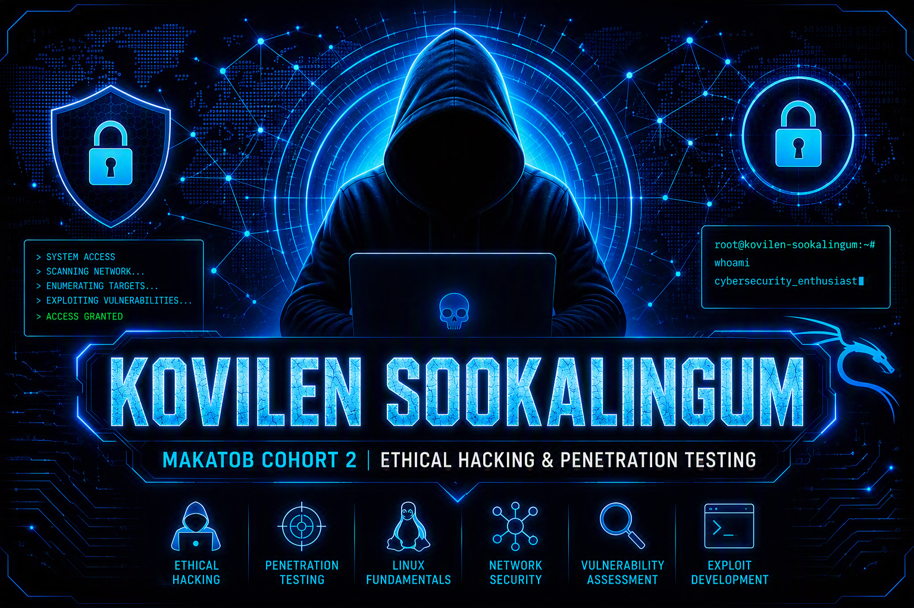

<div align="center">

  <!-- 1. Static subtitle -->
  <p>
    
  </p>

  <!-- 2. Typing animation -->
  

  <br/><br/>

  <!-- 3. Banner -->
  

  <br/><br/>

  <!-- 4. Main badges (bigger via height) -->
  <p align="center">
    
    
    
    
  </p>

  <!-- 5. Tools row (bigger via height) -->
  <p align="center">
    
    
    
    
  </p>

  <!-- 7. Divider -->
  

</div>


---

> ### 💡 About This Report
> This document walks through a complete VirtualBox deployment of a **Cybersecurity Lab VM** on a Windows host — from downloading VirtualBox to taking a baseline snapshot. Every step is illustrated with an actual screenshot captured during the process.

---

## 📋 Environment

<table>
  <tr><td><b>🖥️ Host OS</b></td><td>Windows</td></tr>
  <tr><td><b>🧰 Hypervisor</b></td><td>Oracle VirtualBox</td></tr>
  <tr><td><b>🐧 Guest</b></td><td>Cybersecurity Lab VM / Workstation (Ubuntu-based)</td></tr>
  <tr><td><b>📸 Screenshots</b></td><td>26 original captures from the deployment</td></tr>
</table>

---

## 📑 Table of Contents

| # | Section |
|---|---|
| 1 | [Introduction](#1--introduction) |
| 2 | [Lab Objectives](#2--lab-objectives) |
| 3 | [Environment & Login Reference](#3--environment--login-reference) |
| 4 | [Step-by-Step: Deploying the VM](#4--step-by-step-deploying-the-vm) |
| 5 | [Step 2 Review Questions](#5--step-2-review-questions) |
| 6 | [Reflection Question](#6--reflection-question) |
| 7 | [Conclusion](#7--conclusion) |

---

## 1 · Introduction

This report documents the deployment of a Linux-based cybersecurity lab virtual machine on a **Windows host** using **Oracle VirtualBox**.

Based on the screenshots captured during the process, the appliance used is the **Cybersecurity LabVM / Workstation** — an Ubuntu-based, Cisco Networking Academy (NetAcad) style lab image pre-loaded with security tools such as **Wireshark**, rather than a stock Kali Linux ISO.

It serves the same purpose for this lab: a dedicated environment for practicing **command-line fundamentals**, **user/permission management**, and **basic security tooling**.

> Every step below is illustrated with an actual screenshot taken during this deployment. Duplicate or near-identical captures have been removed so each figure shows something new.

---

## 2 · Lab Objectives

<table>
  <tr><td>🚀</td><td>Deploy the Cybersecurity Lab VM appliance in VirtualBox on a Windows host.</td></tr>
  <tr><td>⚙️</td><td>Configure VM settings: memory, CPU, storage, and network adapter.</td></tr>
  <tr><td>✅</td><td>Verify the VM boots correctly and log in to the desktop environment.</td></tr>
  <tr><td>🧠</td><td>Explore terminal command history and event-designator (<code>!N</code>, <code>!prefix</code>) behavior.</td></tr>
  <tr><td>🌐</td><td>Verify network connectivity from inside the VM and update installed packages.</td></tr>
  <tr><td>📝</td><td>Answer the lab's review and reflection questions based on hands-on observation.</td></tr>
</table>

---

## 3 · Environment & Login Reference

The appliance's login screen offers **three preset environments**, each mapped to a different role. This was captured directly from the VM's boot/login screen:

<table>
  <thead>
    <tr>
      <th>Role</th>
      <th>Username</th>
      <th>Password</th>
    </tr>
  </thead>
  <tbody>
    <tr>
      <td>🔵 Cybersecurity Analyst / Support Technician <i>(default)</i></td>
      <td><code>cisco</code></td>
      <td><code>password</code></td>
    </tr>
    <tr>
      <td>🟡 SOC Analyst (CyberOps Associate)</td>
      <td><code>analyst</code></td>
      <td><code>cyberops</code></td>
    </tr>
    <tr>
      <td>🔴 Security Engineer (Network Security)</td>
      <td><code>sec_admin</code></td>
      <td><code>net_secPW</code></td>
    </tr>
  </tbody>
</table>

> The terminal prompts throughout this deployment show `[analyst@secOps ~]$`, confirming the **SOC Analyst** profile (`analyst` / `cyberops`) was the one used for the hands-on work.

---

## 4 · Step-by-Step: Deploying the VM

### 🟣 Step 1 — Download and Install VirtualBox

Before any appliance can be imported, **Oracle VirtualBox** itself must be installed on the Windows host. This was downloaded from the official VirtualBox site (`virtualbox.org/wiki/Downloads`), which offers platform packages for Windows, macOS (Intel and Apple Silicon), Linux, and Solaris hosts, plus the separate **VirtualBox Extension Pack** (version 7.2.18 at the time of this lab) for USB 2.0/3.0 support and other extras.

The **Windows hosts** package was selected and installed with default settings.


> **Figure 4.1** — `virtualbox.org/wiki/Downloads`: selecting the Windows hosts platform package (VirtualBox 7.2.18).

---

### 🟣 Step 2 — Explore & Download the Appliance

The **Kali Linux downloads page** (`kali.org/get-kali`) was first consulted to review the available pre-built virtual machine formats — **VMware**, **VirtualBox**, **Hyper-V**, and **QEMU** are all offered there, each with default credentials `kali`/`kali`.


> **Figure 4.2** — `kali.org/get-kali` showing the Pre-built Virtual Machines options (VMware, VirtualBox, Hyper-V, QEMU).

The actual appliance used for this lab, however, was downloaded from the course's own lab-resources page: **`Cybersecurity_Lab_VM_Worksation_20250409.ova`** (≈2.9 GB), a ready-to-import VirtualBox appliance.


> **Figure 4.3** — Downloading `Cybersecurity_Lab_VM_Worksation_20250409.ova` (2.9 GB) via the browser's Downloads panel.

---

### 🟣 Step 3 — Import the Appliance into VirtualBox

With VirtualBox open, **File → Import Appliance** was used to select the downloaded `.ova` file. The **Appliance Settings** screen then displayed the suggested configuration:

<table>
  <tr><td>🐧 <b>Guest OS type</b></td><td>Ubuntu (64-bit)</td></tr>
  <tr><td>🧠 <b>CPU</b></td><td>2</td></tr>
  <tr><td>💾 <b>RAM</b></td><td>4098 MB</td></tr>
  <tr><td>🔊 <b>Sound Card</b></td><td>ICH AC97</td></tr>
  <tr><td>📁 <b>Base folder</b></td><td><code>C:\Users\...\VirtualBox VMs</code></td></tr>
</table>


> **Figure 4.4** — Import Virtual Appliance: Appliance settings screen before clicking Finish.

---

### 🟣 Step 4 — Configure VM Settings

After import, the VM's **Settings** window was used to confirm the resource allocation. The **General** tab confirms the VM name, OS type/distribution (**Linux – Ubuntu, 64-bit**), and shows **Base Memory set to 4098 MB** with the boot order (Hard Disk, then Optical).


> **Figure 4.5** — Settings → General/System: VM name, OS type, and 4098 MB base memory with boot device order.

The **System** tab confirms **2 CPUs** allocated (out of a possible 4), and the **Display** tab shows **64 MB of video memory** with a single virtual monitor.


> **Figure 4.6** — Settings → System/Display: 2 CPUs allocated and 64 MB video memory.

Finally, the **Network** tab was checked to confirm the adapter mode. **Adapter 1** was left set to **NAT** (with **Bridged Adapter** available as the alternative) — NAT is the appropriate default for an isolated lab environment, since it lets the VM reach the internet through the host without being directly exposed on the local network.


> **Figure 4.7** — Settings → Network: Adapter 1 attached to NAT (Bridged Adapter shown as the alternative).

---

### 🟣 Step 5 — Boot the VM & Log In

Starting the VM boots to a custom login screen for the **Cybersecurity LabVM / Workstation**, listing the three role-based accounts described in Section 3. The **Cybersecurity Analyst / Support Technician** profile is selected by default.

```
1. Cybersecurity Analyst - Support:      Log in
2. SOC Analyst (CyberOps Associate):     Log in: analyst  Pwd: cyberops
3. Security Engineer (Network Security): Log in: sec_admin  Pwd: net_secPW
```


> **Figure 4.8** — VM boot/login screen listing the three available lab-user environments and their credentials.

After logging in (as the **SOC Analyst** profile, `analyst` / `cyberops`), the desktop loads successfully, confirming the VM is fully operational.

---

### 🟣 Step 6 — Explore the Desktop

The desktop environment includes shortcuts for **Firefox Web Browser**, **Wireshark**, a **Terminal**, an on-screen **Keyboard**, and a **DPI Scanning** tool, alongside the **analyst's Home** folder — confirming the security-tool set expected of a cybersecurity lab image.


> **Figure 4.9** — Desktop after login, showing Firefox, Wireshark, Terminal, Keyboard, and DPI Scanning shortcuts.

---

### 🟣 Step 7 — Open a Terminal & Edit sudoers (visudo)

A terminal was opened and `sudo visudo` run to edit the sudoers file safely. The terminal first prompts for the analyst account's sudo password.


> **Figure 4.10** — Terminal prompting `[sudo] password for analyst` after running `sudo visudo`.

Once authenticated, `visudo` opens `/etc/sudoers.tmp` in the **nano** editor, showing the default sudoers policy (`env_reset`, `mail_badpass`, `secure_path`, `use_pty`, and the commented-out proxy/EDITOR lines).


> **Figure 4.11** — nano editing `/etc/sudoers.tmp` via visudo (54 lines read).

---

### 🟣 Step 8 — Verify sudo Group Membership

Running `grep sudo /etc/group` confirms which local accounts belong to the sudo group. The output shows all three lab accounts — `cisco`, `analyst`, and `sec_admin` — are members, which is why each of the three role profiles can run privileged commands.


> **Figure 4.12** — `grep sudo /etc/group` confirming `cisco`, `analyst`, and `sec_admin` are all in the sudo group.

---

### 🟣 Step 9 — Review Command History

Running `history` lists every command entered in the session so far:

```
1  visudo
2  clear
3  sudo visudo
4  grep sudo /etc/group
5  sudo visudo
6  history
```


> **Figure 4.13** — Output of the `history` command for this session.

---

### 🟣 Step 10 — Verify Network Connectivity *(added step)*

To confirm the NAT adapter configured in Step 3 was working correctly, `ip a` was run to check the assigned address, followed by `ping -c 4 kali.org`. The VM received the address **10.0.2.15/24** — the standard VirtualBox NAT range — and the ping test succeeded with replies in the **6–9 ms** range, confirming outbound internet access through the host.


> **Figure 4.14** — `ip a` showing the NAT-assigned address 10.0.2.15, followed by a successful ping to `kali.org`.

---

### 🟣 Step 11 — Update System Packages *(added step)*

With connectivity confirmed, `sudo apt install` and `sudo apt upgrade` were run to bring the appliance's packages up to date. The upgrade identified several new kernel and driver packages to install, flagged one package (`libwmf0.2-7`) as no longer required, and — notably — **held back** the pre-installed `wireshark`, `wireshark-common`, and `wireshark-qt` packages rather than upgrading them automatically.


> **Figure 4.15** — `sudo apt install` / `sudo apt upgrade`: new kernel packages queued, Wireshark packages held back.

---

### 🟣 Step 12 — Take a Snapshot of the VM *(added step)*

As a final step, a **VirtualBox Snapshot** was taken of the freshly configured and updated VM. Snapshots capture the exact state of the virtual disk and memory at a point in time, so the machine can be rolled back instantly if a later experiment (for example, a risky command or a tool misconfiguration) breaks something.

The snapshot was named **"new machine"** with the description **"back to new, in case something went wrong to the machine"** — a clean baseline to return to.


> **Figure 4.16** — Take Snapshot of Virtual Machine: naming the baseline snapshot "new machine" before further use.

> 💡 **Best Practice** — Take a snapshot immediately after a known-good setup, and again before any step that carries real risk of breaking the environment (installing untrusted tools, editing system files, running exploits, etc.). Restoring a snapshot in VirtualBox takes only a few seconds, versus re-importing and reconfiguring the whole appliance from scratch.

---

## 5 · Step 2 Review Questions

These questions are answered using the **actual command history** captured on this VM (Figure 4.13), which differs slightly from the lab's original example history:

```
1  visudo
2  clear
3  sudo visudo
4  grep sudo /etc/group
5  sudo visudo
6  history
```

---

### 🅰️ How many times did you need to press the Up Arrow to reach `visudo`?

Starting at the prompt right after running `history` (entry 6):

| Press | Command reached |
|---|---|
| 1st ↑ | `history` (6) |
| 2nd ↑ | `sudo visudo` (5) |
| 3rd ↑ | `grep sudo /etc/group` (4) |
| 4th ↑ | `sudo visudo` (3) |
| 5th ↑ | `clear` (2) |
| 6th ↑ | `visudo` (1) |

> ✅ **Answer: 6 times.**

---

### 🅱️ From `visudo`, how many times would you need to press the Down Arrow to reach `sudo visudo`?

Starting from `visudo` (entry 1) and moving forward in time:

| Press | Command reached |
|---|---|
| 1st ↓ | `clear` (2) |
| 2nd ↓ | `sudo visudo` (3) — the first occurrence of "sudo visudo" reached going downward |

> ✅ **Answer: 2 times.**

---

### 🅲 At the prompt, enter `!3`. What command is displayed?

History entry **#3** in this session is `sudo visudo`. Entering `!3` displays and immediately re-executes it, which is exactly what the terminal capture shows.


> **Figure 5.1** — `!3` expands to and re-executes `sudo visudo`, prompting for the password again.

> ✅ **Answer: `sudo visudo`** — this command also executes automatically once displayed.

---

### 🅳 At the prompt, enter `!his`. What command is displayed?

In the lab's original example, `!his` would be expected to match "history" (the only recent entry starting with "his") and re-run it. On this VM, however, the capture shows `!his` instead resolving to a separate installed program called **`hist`** (a histogram/binning utility, with its own `-c`/`-f`/`-h`/`-i`/`-b`/`-r`/`-o`/`-p` options) rather than the shell's own `history` command.


> **Figure 5.2** — `!his` on this VM resolves to the `hist` utility's usage message, not the `history` command.

> ⚠️ **Answer:** On this environment, `!his` expanded to `hist`, **not** `history`, and printed that program's usage text instead of the command history. This is a real difference from the original lab's expected result, documented here exactly as observed rather than the textbook answer.

---

### 🅴 Enter `hi` and press Tab. What is the output?

The capture on this VM shows `hi` entered and **run** (Enter pressed) rather than completed with Tab, producing `hi: command not found`. This still demonstrates the underlying point: "hi" is not itself a valid command or a unique completion target, so nothing usable is produced from it without additional characters.


> **Figure 5.3** — `hi` run without completion resolves to `command not found`.

> ✅ **Answer: `bash: hi: command not found`** (as run). Had Tab been pressed instead of Enter, the same non-uniqueness would apply — "hi" does not match a single command, so completion would not resolve until more characters were typed (e.g. `"hist"` + Tab would complete toward a matching command).

---

## 6 · Reflection Question

> ❓ **What are the benefits of using either the installer image or the pre-built image to create the VM?**

<table>
  <thead>
    <tr>
      <th>🟢 Pre-Built Appliance (.ova)</th>
      <th>🔵 Installer ISO Image</th>
    </tr>
  </thead>
  <tbody>
    <tr><td>Faster deployment and setup</td><td>Allows full customization during installation</td></tr>
    <tr><td>Already configured with required tools and settings</td><td>Greater control over disk layout, packages, and settings</td></tr>
    <tr><td>Ideal for labs, training, and beginners</td><td>Can be tailored to specific requirements</td></tr>
    <tr><td>Reduces installation and configuration errors</td><td>Provides hands-on experience installing and configuring Linux manually</td></tr>
  </tbody>
</table>

For this lab specifically, the pre-built **Cybersecurity LabVM / Workstation `.ova`** was the clear choice: it arrived with **three ready-made role accounts**, **Wireshark and other tools pre-installed**, and a **working network configuration** — letting the lab focus on shell fundamentals rather than OS installation.

---

## 7 · Conclusion

This lab walked through deploying a **Cybersecurity Lab VM appliance** on a Windows host using **Oracle VirtualBox** — importing the `.ova`, configuring CPU/RAM/network settings, and confirming a successful boot and login. Beyond the original lab steps, network connectivity and package updates were also verified directly from the VM.

Exploring the shell's command history and event-designator behavior (`!N`, `!prefix`) reinforced how Bash speeds up repetitive command-line work, while also surfacing a real, documented difference from the textbook example (`!his` resolving to `hist` rather than `history`) — a useful reminder that **lab environments can behave slightly differently from their written instructions**, and it pays to verify rather than assume.

---

<div align="center">

  

  <sub>📄 Lab 1 — MAKATOB Cohort 2 | Kovilen Sookalingum</sub>

</div>
