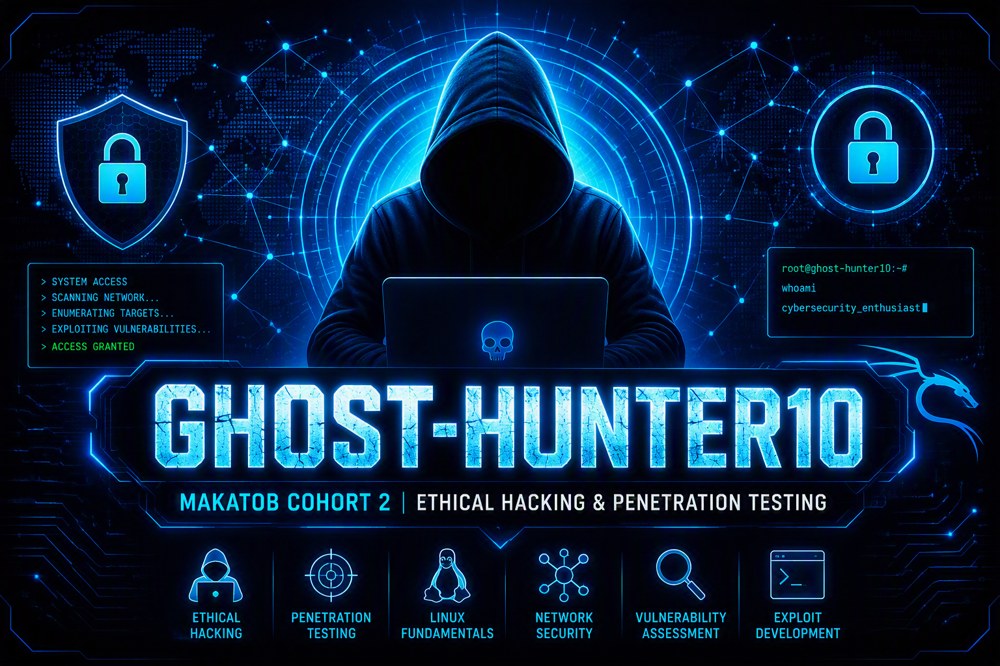

<!-- ============================================================ -->
<!-- HEADER: Kali GIF → Banner → Typing → Badges → Social →      -->
<!-- Palette: Red (#FF0000) · Blue (#0066FF) · Yellow (#FFD700)  -->
<!-- ============================================================ -->

  <!-- 2. Full-width banner -->
  

    

  <!-- 3. Typing animation (yellow on black) -->
  

   

  <!-- 4. Badges (Red · Blue · Yellow) -->
  

    
    
    
    
  

  <!-- 5. Social links (Red · Blue · Yellow) -->
  

    
    
    
  

---

## 📚 Modules

| # | Module | Status | Evidence |
|---|--------|--------|----------|
| 01 | Cybersecurity Lab VM Deployment | ✅ Complete | [View](./Evidences/Project1labs/) |
| 02 | Shell Fundamentals | 🚧 In Progress | — |
| 03 | Network Scanning | ⏳ Planned | — |
| 04 | Vulnerability Assessment | ⏳ Planned | — |
| 05 | Exploitation | ⏳ Planned | — |
| 06 | Post-Exploitation | ⏳ Planned | — |
| 07 | Reporting | ⏳ Planned | — |

---

## 🗂️ Repository Structure
